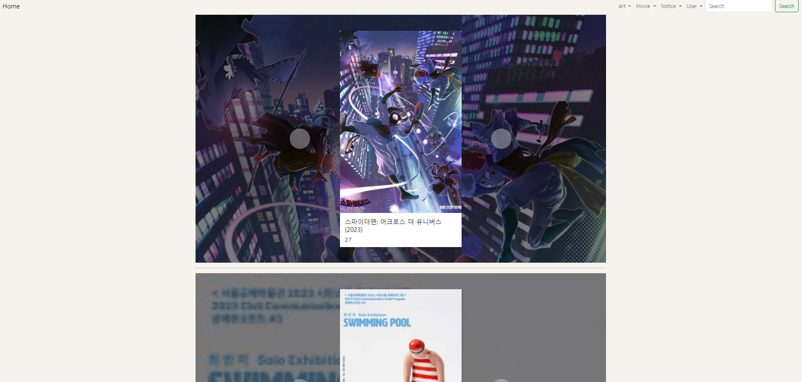

# Django_Web_Project

## Movie & Art Column Platform

### 서비스 소개 

일상생활에서 접할 수 있는 각 종 영화, 전시와 같은 문화요인들이 영상이나 사진으로 빠르게 소모되고 있는 현대사회에서 상업적으로 홍보가 짙은 정보들 외에도 전문성과 다양한 사람들의 의견을 글로써 접할 수 있는 서비스를 제공하고자 합니다.  

## 1. 제작기간 & 참여인원
- 2023.07.03 ~ 2023.07.19
- 개인 프로젝트

## 2. 프로젝트 목적 및 집중 기능
  
### 프로젝트 목적

Python과 Django를 활용하여 CRUD가 가능한 Web을 구현해보고자 합니다.

### 집중기능

Web의 각 유저의 그룹을 구분 후, 각 그룹에 사용할 수 있는 CRUD 기능들을 다르게 제공하고자 합니다. 
- Art : Art 그룹의 유저만 글의 작성, 수정, 삭제 가능
- Exibitions : Exhibition 그룹의 유저만 글의 작성, 수정, 삭제 가능
- Movie, Movie Column : Movie 그룹의 유저만 글의 작성, 수정, 삭제 가능
- Profile : 각 유저가 작성, 스크랩, 좋아요 한 글 확인 기능 / 팔로우 기능
- 소셜 로그인

## 3. 주요 기술

- 사용 언어 : Python

- framework : Django

- HTML / CSS / Bootstrap / sqlite3

## 4. ERD 설계

 

## 5. 구현 기능

Main Page

- movies, exhibitions 중 상영 및 전시 중인 목록을 Carousel로 출력

### 1. User의 구분
- Admin :
  
   각 게시판의 모든 기능 사용 가능

- Art, Exhibition, Movie : 
  
  각 게시판 관련 전문성을 Admin에게 인증을 받은 후, 해당 게시판의 모든 기능 사용 가능

- 일반 유저 : 
  
  각 게시판에 작성, 수정, 삭제의 권한은 없으나 댓글 및 팔로우, 스크랩, 좋아요 등의 기본적인 기능 사용 가능

### 2. User 그룹 별 Navbar 분리

Movie의 권한이 있는 유저

 

Movie의 권한이 없는 유저

### 3. 각 게시판의 목록

ex. 영화 컬럼 목록

- 한 페이지당 6개의 글 목록 출력, pagination 사용
  

ex. 영화 목록

- 일반유저의 평점 평균을 출력
- 상영 중 영화에 상영중! 표시

### 4. 게시글 작성

ex. 영화 작성

- CKEditor를 사용한 input
- On showing을 체크할 경우 main의 Carousel에 해당 글 추가 / 상영중! 표시

### 5. 게시글

ex. 영화 게시글

- 좋아요 기능 
- 유저의 그룹에 따라 전문가 리뷰와 회원 리뷰 작성 기능 부여
- 전문가와 회원의 점수를 나누어 평균 평점을 출력
- 전문가는 해당 페이지에서 컬럼 작성하기 버튼 활성화
  

### 6. Profile
- 해당 유저의 작성글 목록
- 해당 유저의 스크랩 목록
- 해당 유저의 좋아요를 누른 영화 및 전시 목록
- 팔로우 기능
- 비밀번호 변경 및 정보수정, 회원 탈퇴 기능
  

### 7. 검색
- 해당 문자열이 제목에 포함 된 게시글을 출력
  

## 6. 개선할 점

DB에서 영화 감독 및 배우 등의 DB를 따로 구성하여 수동 입력이 아닌 해당 배우 및 감독의 페이지에서 영화를 추가 하면 양쪽에서 모두 출력되는 기능을 만들고 싶다.

검색 기능을 제목이 아닌 제목 + 내용, 제목, 작성자 등 세분화 해서 더 많이 구현하고 싶다. 

## 7. 느낀 점

Django와 CRUD기능의 구조에 대한 이해의 중요성과 각 앱의 모델링을 할 때  naming 작업의 중요성을 많이 느꼈다.

프론트엔드 작업이 머리 속에 생각하는 것 만큼 잘 되지 않는 다는 것과 detail이 참 어렵다는 것을 느꼈다. 